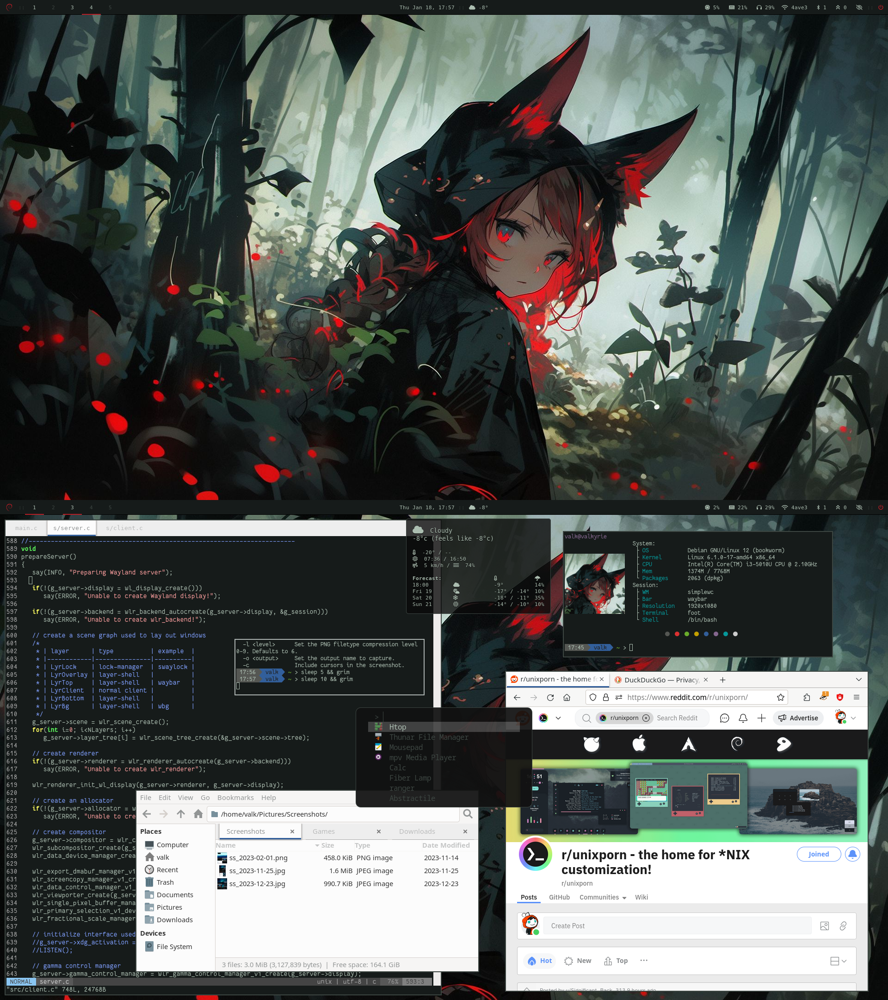

# SimpleWC (Simple Wayland Compositor)

It is a simple wlroots-based compositor (window manager) written to fit my specific needs, and a way 
to teach myself the basics of window management. 

## Description

 - Minimal stacking (floating) window manager for Wayland using [wlroots] (currently based on wlroots v0.19)
 - Not meant to be tiny or fast, but aims for simplicity in design and coding
 - Written in C
 - Built upon [tinywl], inspirations from [dwl] and [labwc]
 - Features:
   - No frills (menu, titlebar, icons, animations, pixmap themes, etc...)
   - Text config file (default $HOME/.config/simplewc/configrc)
   - Simple tiling (manual left-right or top-bottom tiling or one-shot auto-tile like DWL/DWM)
   - Support dwl module for waybar via dwl-ipc-unstable protocol

[wlroots]: https://gitlab.freedesktop.org/wlroots/wlroots
[tinywl]: https://gitlab.freedesktop.org/wlroots/wlroots/-/tree/master/tinywl
[dwl]: https://codeberg.org/dwl/dwl
[labwc]: https://github.com/labwc/labwc
[dwlmsg]: https://codeberg.org/notchoc/dwlmsg

### Screenshots

v0.1

### Usage

    > simplewc [--config file][--start cmd][--exit][--debug|--info][--version][--help]

### Build

    > meson setup [-Dxwayland=enabled|disabled] build
    > ninja -C build || exit 1
    > sudo ninja -C build install

 - Build dependencies:
   - wlroots
   - libxkbcommon (usually a dependency of wlroots)
   - libinput (usually a dependency of wlroots)
   - xwayland (optional)
   - libxcb (optional - for xwayland)

### Configuration

Default configuration file read from `$HOME/.config/simplewc/configrc`, and allows users to customize:

 - window management behaviour: ( # of tags, tile gaps, movement steps etc )
 - window border width and colour
 - autostart script (e.g. set background, invoke status-bar, launch idle-inhibitor)
 - keyboard layout and options 
 - input options (touchpad, tablet etc)
 - keybinds
 - mouse binds 

## Version Log

Please use [Github Issues Tracker][ghit] to report bugs and issues.

  - 0.5 (work in progress)
    - Goal: Continue to improve the compositor.
    - Uses wlroots v0.19
  - 0.4 (2025-06-16) ([download][v04])
    - Goal: Continue to improve the compositor, optimize for efficiency.
    - Uses wlroots v0.18
    - Remove simplewc-msg
    - Ability to fix (ie freeze) tag per output
    - Tablet input support (limited)
  - 0.3 (2025-04-12) ([download][v03])
    - Goal: Better support for multihead and fullscreen
    - Uses wlroots v0.18
    - Improved support for multihead
    - Added fullscreen support
    - Added support for wlr_relative_pointer_manager_v1
  - 0.2 (2024-08-29) ([download][v02])
    - Goal: add in additional features
    - Uses wlroots v0.17
    - Added visibility toggle (a.k.a. iconify) and maximize functionality
    - Added support for wlr_idle_notifier_v1, wlr_idle_inhibit_v1, and wlr_session_lock_manager_v1 (e.g. swaylock)
    - Added support for wlr_output_power_management_v1 (e.g. wlopm)
    - ~~Added support for wlr_gamma_control_manager_v1~~ (Removed in version 0.5)
    - ~~Added feature to send action via simplewc-msg~~ (Removed in version 0.4)
    - Added support for dragging icons
    - Improve client cycling function
    - See ChangeLog for fixed bugs
  - 0.1 (2023-12-23) ([download][v01])
    - Goal: get the base code in working order
    - Uses wlroots v0.17

[v01]: https://github.com/kcirick/simplewc/archive/refs/tags/v0.1.tar.gz
[v02]: https://github.com/kcirick/simplewc/archive/refs/tags/v0.2.tar.gz
[v03]: https://github.com/kcirick/simplewc/archive/refs/tags/v0.3.tar.gz
[v04]: https://github.com/kcirick/simplewc/archive/refs/tags/v0.4.tar.gz
[ghit]: https://github.com/kcirick/simplewc/issues

